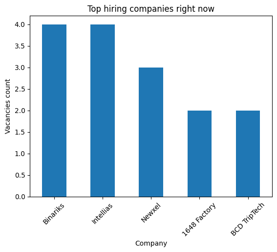
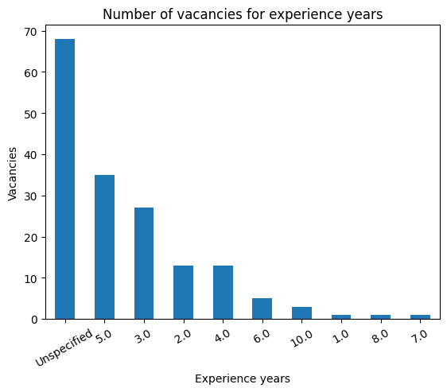
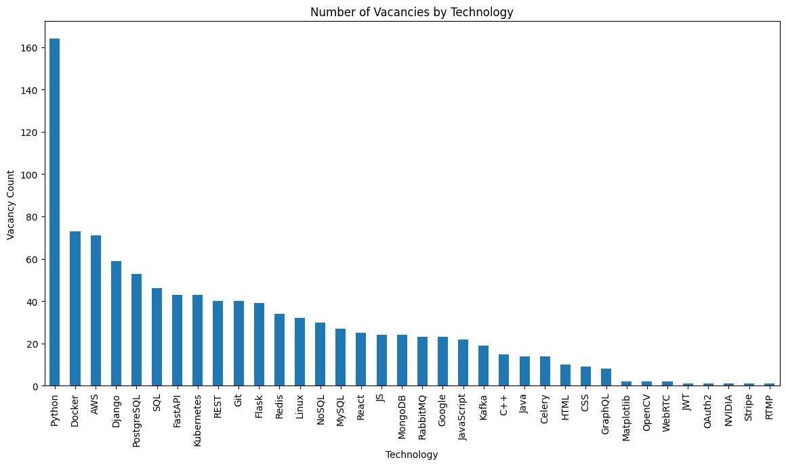
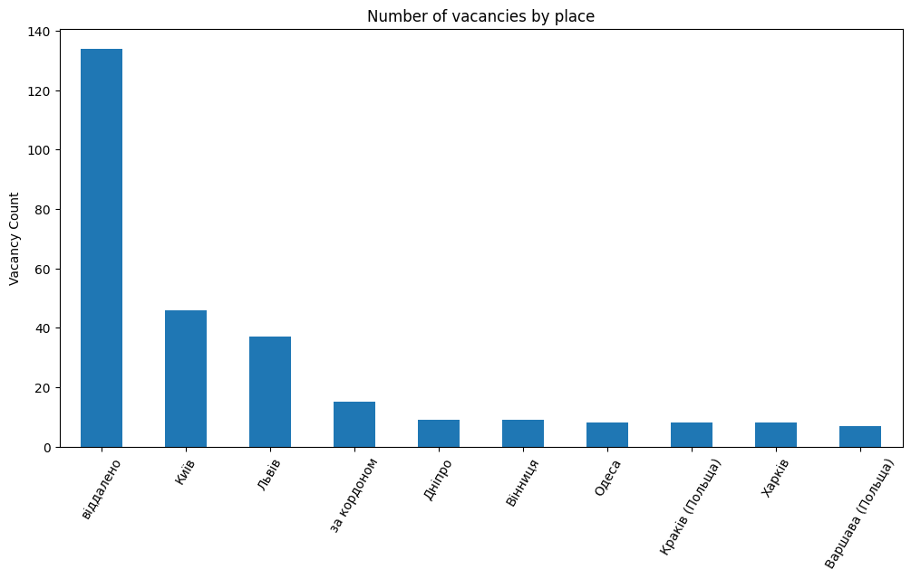

# Dou Job Analysis

## Overview

This project scrapes job listings from the [DOU](https://jobs.dou.ua/vacancies/?category=Python) website in the Python category and analyzes the data to extract insights into hiring trends, experience requirements, popular technologies, and vacancy distribution by location. The project consists of two primary phases: data collection via web scraping and data analysis.

---

## Features

1. **Data Collection**:
   - The project uses `Scrapy` and `Selenium` to collect data on Python job vacancies from the DOU job portal.
   - Extracted data includes job titles, companies, publish dates, experience requirements, locations, salaries, and associated technologies.
   - Scraped data is stored in a SQLite database and exported to CSV for analysis.

2. **Data Analysis**:
   - The collected data is analyzed with `pandas` and visualized to provide insights, such as:
     - Top hiring companies.
     - Job experience distribution.
     - Popular technologies in demand.
     - Vacancy distribution across different locations.
     
---

## Project Structure

- **Scrapy Spider**:
   - `DouSpider`: A custom Scrapy spider with Selenium integration to handle dynamic loading.
   - Crawls and extracts data on various job attributes.
   - Handles pagination and dynamically loaded content using Selenium.

- **Data Storage and Pipeline**:
   - `TechnologiesAnalysisPipeline`: A custom pipeline that stores scraped items in a SQLite database.
   - Sets up and manages the database schema.

- **Analysis Scripts**:
   - Scripts to export data from the SQLite database to a CSV file.
   - Utilizes `pandas` for aggregating and analyzing the data and `matplotlib` for plotting the results.

## Setup Instructions

1. **Installing using GitHub & Requirements**:
   - Python 3.7+
   - Dependencies in `requirements.txt` (e.g., `Scrapy`, `Selenium`, `pandas`, `matplotlib`).

    ```shell
    git clone https://github.com/MasakDirt/python-techonologies-analysis.git
    cd airport
    python -m venv venv
    pip install -r requirements.txt 
    ```

2. **Environment Setup**:
   - Use `.env` to configure `DB_NAME` and `TABLE_NAME` for SQLite database settings.

3. **Running the Scraper**:
   ```bash
   scrapy crawl dou
   ```
   This command will initiate the scraper, which collects job data and stores it in the SQLite database.
4. **Running the Analysis**:
   After scraping, run the data export and analysis scripts - [dou_statistic.ipynb](analysis%2Fdou_statistic.ipynb).
   The analysis script will generate visualizations such as bar charts of hiring trends and technology demands.

---

## Results

The project provides the following insights:

1. **Top Hiring Companies**:
   - Highlights the companies with the highest number of vacancies.
   
    
2. **Experience Requirements**:
   - Visualizes the distribution of vacancies based on required years of experience.

    
3. **In-Demand Technologies**:
   - Shows the most popular technologies for Python-related roles.

    
4. **Vacancies by Location**:
   - Maps out the cities with the most job opportunities.

       

---

## Future Enhancements

Potential improvements include:
- Expanding the scraper to other job categories or websites.
- Adding automated alerts for new vacancies.
- Implementing sentiment analysis on job descriptions for additional insights.
